---
title: 遥感卫星影像的切片处理
---
凑合凑合写的涵盖一些功能的小程序，对窗体进行了美化，图标在阿里巴巴上找的包括超图的官方图标。

# 1.系统主界面

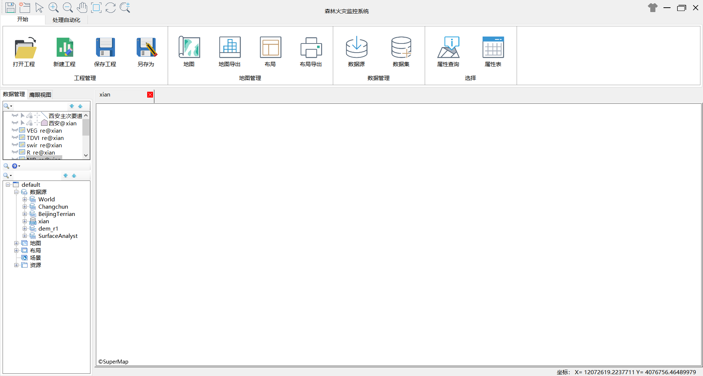

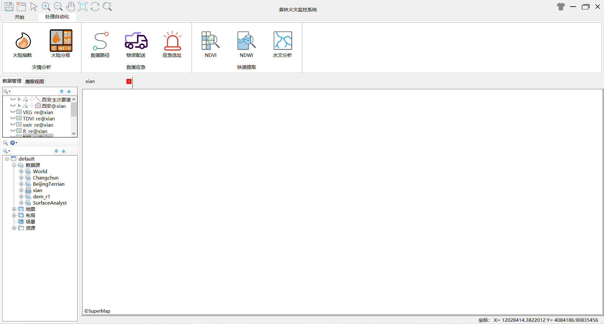

1. 菜单栏。
2. 工程管理。
3. 地图管理。
4. 数据管理。
5. 选择。
6. 灾情分析。
7. 救急应援
8. 快速提取
9. 鹰眼图

10、坐标信息

系统主界面主要使用SuperMap iObjects和Visual Studio中提供的控件以及布局容器，主要包括了最上方的便捷菜单栏实现工程的打开与保存、布局的放大、缩小选择、全屏显示、刷新等功能；简易菜单栏下方为主菜单栏，主要包括了工程管理、地图管理、数据管理、属性查询等；右上角可以设计系统主题颜色、窗口的最小化与最大化以及关闭应用；左侧设计了数据管理窗口与鹰眼图显示窗口；右侧为主视图，用于显示加载的地图或相关数据，再点击“布局”后也可加载出布局视图；右下角为坐标信息。

# 2.菜单栏

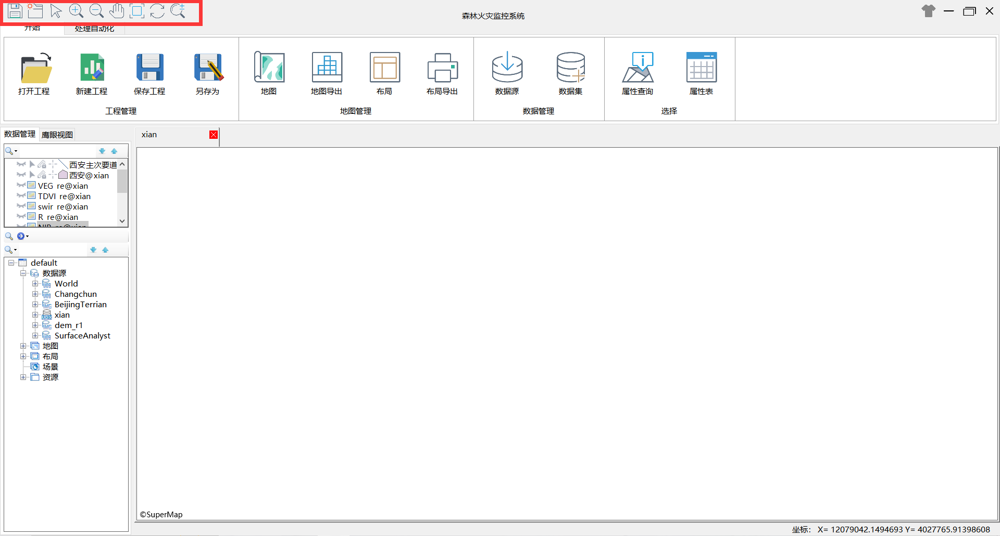

图2-1 主菜单栏

点击，用户可以保存当前工作空间，勾选所需要保存的地图或布局，然后点击保存，当前工作空间将会保存至默认数据所在文件位置。

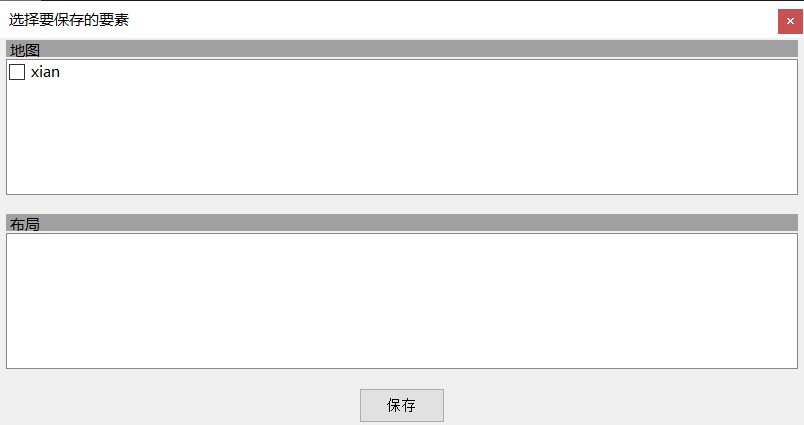

图2-2 保存

用户还可以创建新的工作空间，点击，点击浏览，选择所需要创建的工作空间的所在路径，设置工作空间名称，以及所要保存的工程类型，点击确定，完成新的工作空间的创建。

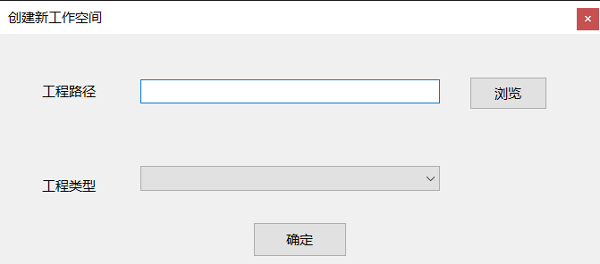

图2-3 创建新的工作空间

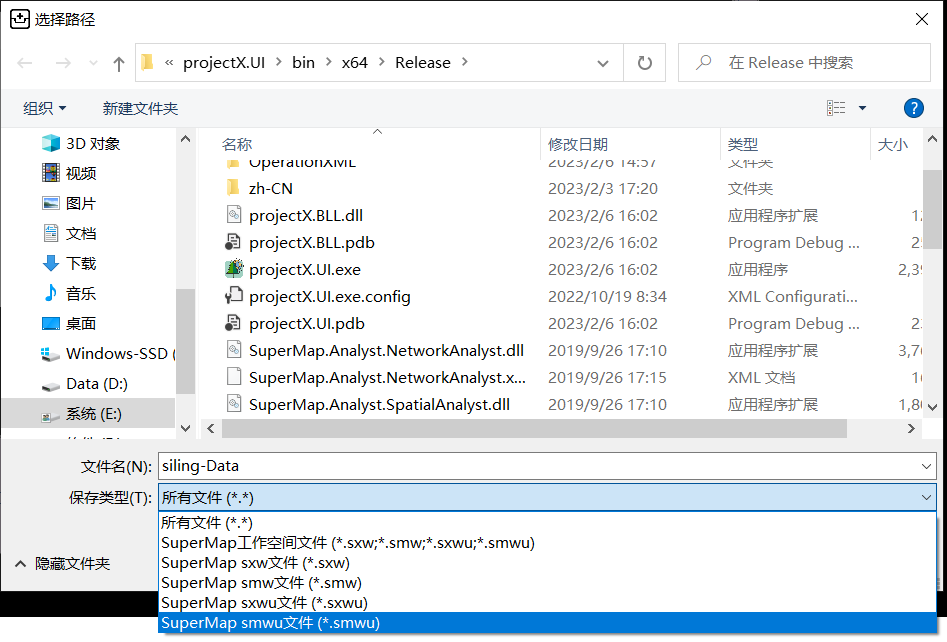

图2-4 选择路径

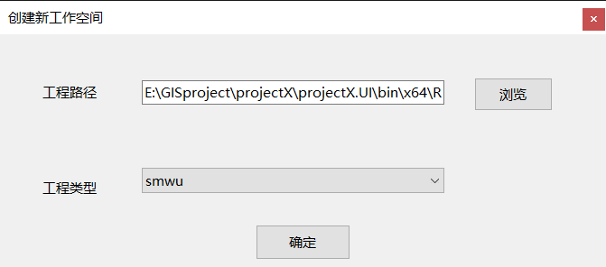

图2-5 选择工程类型

点击，可以对当前地图中的要素进行选择，可以看出所选择的要素高亮显示了。

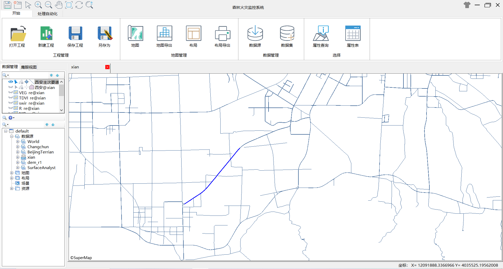

图2-6 选择要素

点击，，可以进行当前地图的放大和缩小，也可通过滑动鼠标滚轮来实现，点击可以进行地图的拖拽，实现全屏显示当前地图，刷新显示当前地图，自由缩放至适应当前窗口大小。

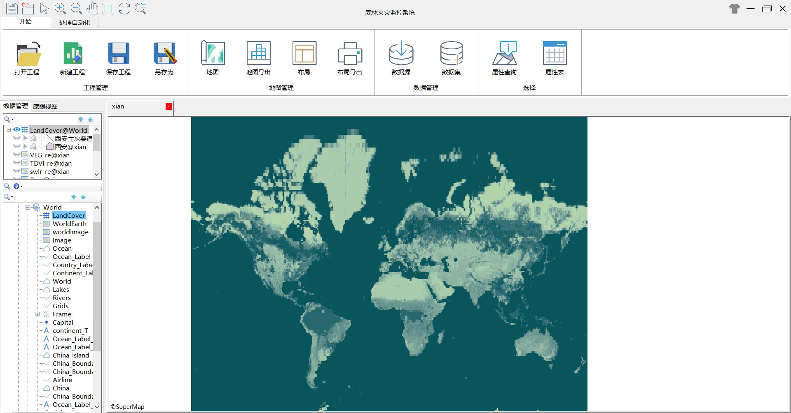

图2-7 要素缩放

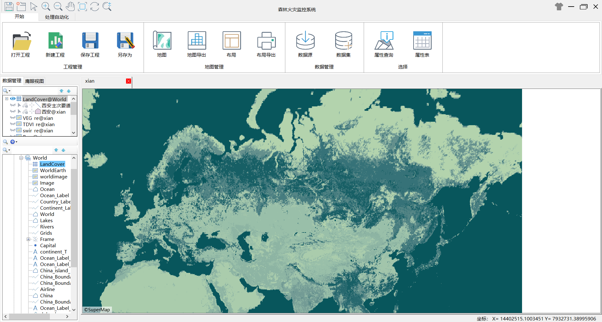

图2-8 放大

系统主题颜色设置，点击，可以选择所需要的颜色或进行自定义设置主题颜色。点击，进行系统窗口的最小化，“还原”，“关闭”系统。

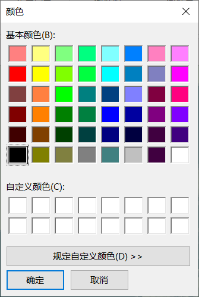

图2-9 设置主题颜色

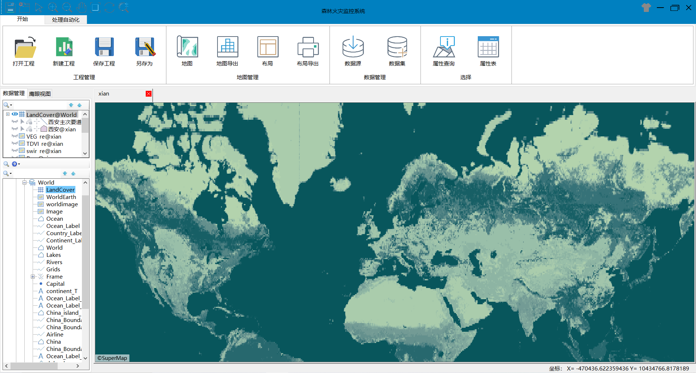

图2-10 主题显示

# 3.工程管理

工程管理，主要包括了打开工程、新建工程、保存工程、另存为等功能。设计主要使用了SuperMap iObjects所提供的WorkspaceConnectionInfo工作空间连接信息类，包括了工作空间连接的所有信息，如所要连接的服务器名称、用户密码、数据库名称等。“打开工作空间”提供了路径的选择以及所需要的工作空间类型的筛选，SuperMap iObjects支持“\*.sxw;\*.smw;\*.sxwu;\*.smwu\|SuperMap sxw文件\|\*.sxw\|SuperMap smw文件\|\*.smw\|SuperMap sxwu文件\|\*.sxwu\|SuperMap smwu文件\|\*.smwu”类型的相关文件。“新建工程”支持路径的设置，文件名的输入以及文件类型的选择，工程成功创建后，默认创建一张地图，避免工作空间为空。“保存工程”需要勾选所需要保存的要素，如地图或布局，工程存放在默认的数据文件夹下。“另存为”则可以自定义输出路径，输出文件的类型。

## 3.1 菜单

“开始菜单，包括了工程管理、地图管理、数据管理、选择四个部分。工程管理中包括了打开工程、新建工程、保存工程、另存为；地图管理中包括了地图、地图导出、布局、布局导出；选择中设计了属性查询、打开属性表等基础功能。

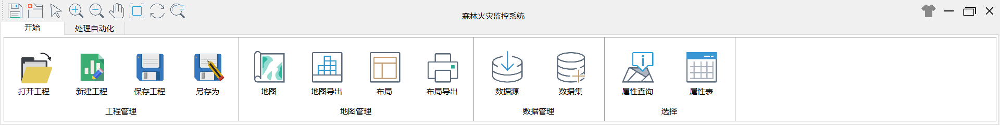

图3-1 开始菜单

在系统最上方菜单中，设计了保存工程、新建工程、选择、放大、缩小、浏览、全屏、刷新等功能。也可以在开始和布局菜单中进行实现。

图3-2 菜单

点击，用户可以保存当前工作空间，勾选所需要保存的地图或布局，然后点击保存；当前工作空间将会保存至默认数据所在文件位置。

图3-3 保存空间

用户还可以创建新的工作空间，点击，点击浏览，选择所需要创建的工作空间的所在路径，设置工作空间名称，以及所要保存的工程类型，点击确定，完成新的工作空间的创建。

图3-4 创建工作空间

图3-5选择路径

图3-6 创建新的工作空间

## 3.2 打开工程

点击打开工程按钮，添加数据工作空间， 所支持的工作空间类型有"SuperMap工作空间文件\|\*.sxw;\*.smw;\*.sxwu;\*.smwu\|SuperMap sxw文件\|\*.sxw\|SuperMap smw文件\|\*.smw\|SuperMap sxwu文件\|\*.sxwu\|SuperMap smwu文件\|\*.smwu"等,如图3-7。可通过系统功能按钮进行拖动、放大、缩小、自由缩放、全图、选择等功能。

图3-7 打开工程

## 3.3保存工程

点击保存工程按钮，勾选所要保存的要素，可以将当前工程进行保存

图3-8 保存工程

点击“另存为”，点击“浏览”设置输出文件的工作路径，在工程类型中下拉选择工程类型，点击“确定”，完成工程的保存。

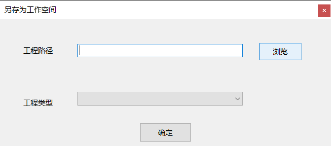

图3-9 另存为

# 4.地图管理

“地图管理”功能下支持了打开地图数据、导出地图、进行地图布局（专题图制作）、布局的导出。

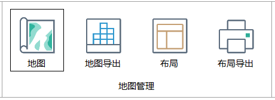

图4-1 地图管理

## 4.1 打开地图

点击，显示打开地图窗口，可以选择打开已有地图或新建地图，点击“确定”，主视面展示所选择的地图。

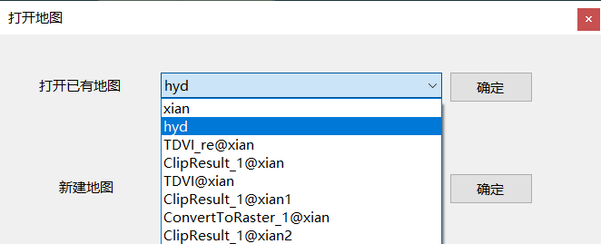

图4-2 选择地图

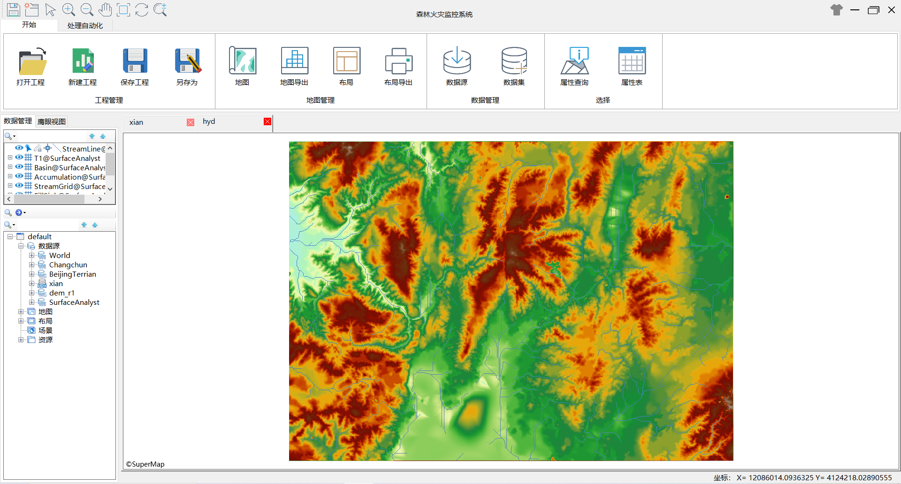

图4-3 打开地图

## 4.2 导出地图

点击，弹出“地图导出”窗口，在地图一栏中下拉选择所要导出的地图，点击“浏览”设置输出路径，然后点击“确定”，导出地图。

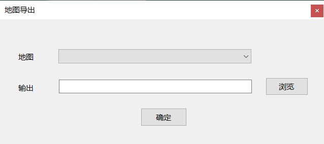

图4-4 导出地图

点击，进行地图要素布局，以及进行专题图的制作。可以选择“打开已有布局”，选择“土地利用规划图_横版”，点击确定，弹出布局模板。

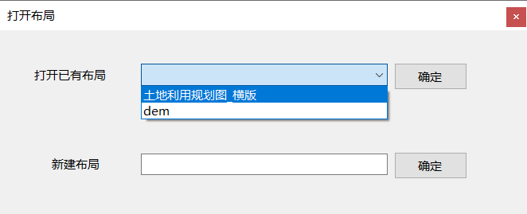

图4-5 打开布局

上方为“开始”，“布局”、“布局对象”三个主要菜单栏，左侧为数据管理窗口，可以看到当前工作空间，工作空间下的地图，布局要素，场景，资源等。

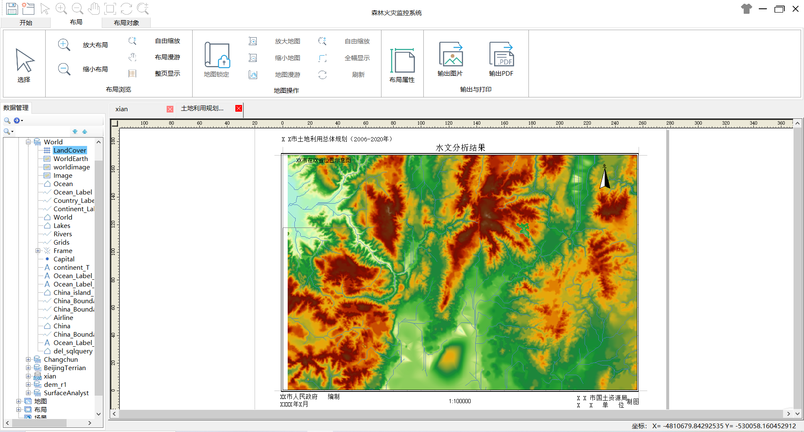

图4-6 布局显示

可以在“布局”菜单栏处进行地图或布局的缩小、放大、全局显示、漫游等功能。点击“布局属性”，可以进行布局背景颜色，纸张颜色，纸张类型，大小，方向等的设置与选择。

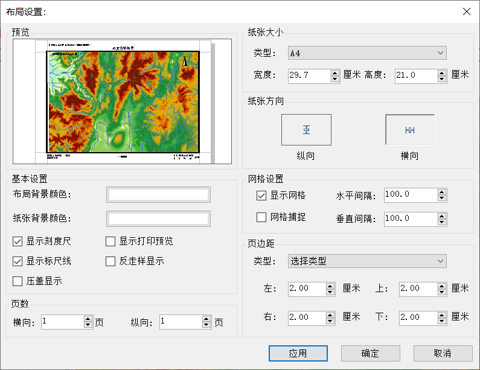

图4-7 布局设置

点击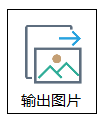可以将当前布局输出为图片，选择输出类型，这里提供了“PNG”、“BMP”、“JPG”“EMF”、“EPS”等格式，然后点击“浏览”，设置输出路径，同时还可以选择设置背景是否透明，以及设置图片输出的dpi与压缩率。

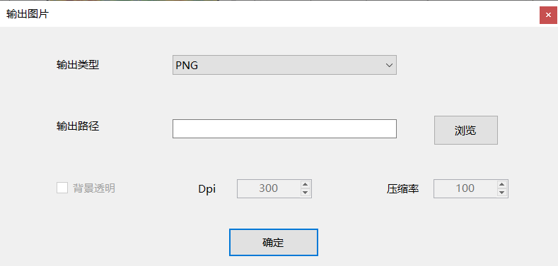

图4-8 输出图片

# 布局

在菜单栏处点击“布局对象”可以进行点、线、面的绘制，在布局中添加图片、文本，添加地图要素，如地图、比例尺、图例、指北针等以辅助专题图的制作。

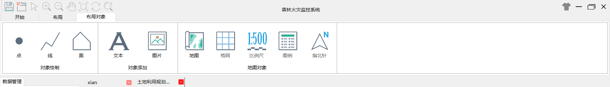

基础功能模块是整个系统的基础部分。主要包括布局的缩小、放大、自由缩放、漫游、整页显示，地图的缩放、漫游、刷新、全幅显示等，还可以进行地图的显示，以及将地图导出为图片或输出为pdf等。

在地图管理中点点击，可以进行地图要素布局，以及进行专题图的制作。如图5-1，上方为“布局”、“布局对象”主要菜单栏，左侧为数据管理窗口，可以看到当前工作空间，工作空间下的地图，布局要素，场景，资源等。

图5-1 布局菜单

“布局”菜单中可以进行选择，布局浏览，地图操作，布局属性，打印与输出；“布局对象”中包括了“对象绘制”、“对象添加”、“地图对象”三个部分。

## 5.1 打开布局

选择“打开已有布局”，选择“土地利用规划图_横版”，点击确定，如图5-2，弹出布局模板。

图5-2 打开布局

## 5.2 布局浏览与地图操作

点击“选择”可以选中地图对象，并对其进行编辑。布局浏览中可以进行布局的放大、缩小、全局显示、自由缩放、布局漫游；地图操作可以放大、缩小地图、地图漫游、自由缩放和全屏显示。该部分都通过SuperMap.UI.Action枚举的方式定义了地图布局的操作状态。

放大时选用SuperMap.UI.Action.ZoomIn组件进行放大，缩小时选用SuperMap.UI.Action.ZoomOut进行缩小。整页显示，使用SuperMap.UI.Map.ViewEntire进行全局显示。

## 5.3 布局属性

点击“布局属性”，可以进行布局背景颜色，纸张颜色，纸张类型，大小，方向等的设置与选择，如图5-3，设置完所需要的属性，点击“应用”“确定”，全部设置完成后，点击“取消”关闭该窗口。

图5-3 布局属性

## 5.4 打印与输出

地图和布局输出为PDF文件，是一种广泛使用的地图输出方式，其优势在于：第一，可以方便地将地图共享给非GIS用户，只需用户计算机安装PDF阅读器；第二，由于PDF允许保留矢量图形和嵌入字体，它可以提供高质量的地图打印素材，是重要的硬拷贝印刷交换格式； 第三，地图和布局输出为PDF文件，有效解决了大幅出图的问题。

SuperMap组件产品支持输出多种多样的文件格式包括：\*.bmp、\*.jpg、\*.png、\*.eps、\*.pdf、\*.emf、\*.gif、\*.tiff。SuperMap 组件产品提供的 MapLayout.PrintToFile() 方法，支持设置出图的图片类型和 DPI 出图方式。对于大幅面、大数据地图的输出，可以通过此接口将地图输出成高分辨率的某种格式的图片，然后再对输出的图片进行打印。此外，以栅格方式打印时，通过设置布局打印处理时的逻辑 DPI（Printer.LogicDPI属性）也可以提升打印的效果。

点击可以将当前布局输出为图片，选择输出类型，这里提供了“PNG”、“BMP”、“JPG”“EMF”、“EPS”等格式，然后点击“浏览”，设置输出路径，同时还可以选择设置背景是否透明，以及设置图片输出的dpi与压缩率，如图5-4.

图5-4 输出图片

点击，点击“浏览”设置输出路径，设置dpi，然后点击“确认”，如图5-5将布局输出，结果如图5-6.

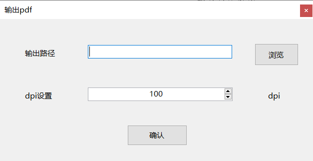

图5-5 输出为pdf

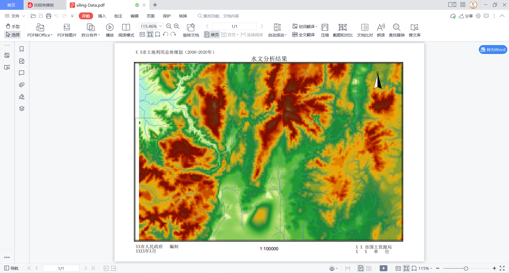

图5-6 输出效果

# 布局对象

地图是根据特定的数学法则，将地球上的自然和社会经济现象，通过制图综合，并以符号和注记缩绘在平面上的图像。在SuperMap中，一个或者多个在同一地理范围下的数据集以图层的方式以一定的风格或专题表现显示在同一个SuperMap地图窗口中，称为地图。

专题地图是为适应某种专门需要而着重显示制图区域内某一种或某几种自然现象或社会经济现象的地图。在SuperMap中专题地图实质上是地图图层的符号化显示，即用各种图形渲染风格（大小，颜色，线型，填充等）来图形化地表现要素的某方面特征。专题制图是对数据进行分析和可视化的一种很有效的方式。给一个数据集赋予一个图层风格，就可以使数据可视化；而通过绘制基于数据集的一个或多个属性的专题图，不仅数据可以可视化，而且用来做专题变量的属性的变化分布状况和规律以及发展变化趋势都将会一目了然。用相同的地理数据可以创建不同的图层来使不同的属性可视化，或者对一个属性使用多种不同的绘制和渲染方法，即创建多种专题图，从而从不同的视角来分析属性的分布规律和变化特征，便于进行预测，预报以及提供专业的决策支持。

创建要素中主要涉及到交互式编辑：绘制点、线、面、文本，MapControl的绘制事件。

在菜单栏处点击“布局对象”（图6-1）可以进行点、线、面的绘制，在布局中添加图片、文本，添加地图要素，如地图、比例尺、图例、指北针等以辅助专题图的制作。

图6-1 布局对象

## 6.1 对象绘制

对象绘制包括了“点”“线”“面”的绘制。在“打开布局”中选择新建布局，输入布局名称，如图6-2，新建的空白布局如图6-3.

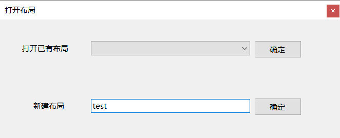

图6-2 新建布局

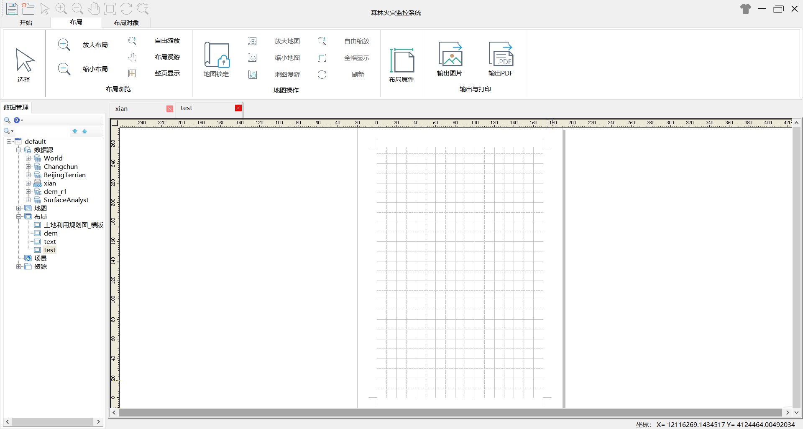

图6-3 新布局

点数据模型（Point）：点是零维形状的，存储为单个的带有属性值的x, y 坐标对。用来描述很小且不能够描述为线或面的地理要素。绘制点涉及到MapControl控件下的CreatePoint属性，点击系统中的“点”，在面板中，选择合适的位置，如图6-4.

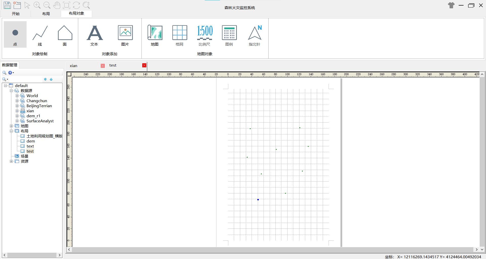

图6-4 绘制点

线数据模型（Line）：线是一维形状的，存储为一系列有序的带有属性值的 x，y 坐标对。线数据模型允许有线复杂对象。线的形状可以是直线、折线、圆、椭圆、或旋转线等，其中圆、椭圆、圆弧等是转化为折线存储的。线数据模型用来描述狭窄且不能够描述为面的地理要素。当我们只关注这些地理要素的走向、长度等一维信息而不考虑其宽度和面积时，都可以用线数据模型来描述，例如作为省界的河流、小比例尺的城市道路等。绘制线涉及到MapControl控件下的CreateLine、CreatePolyline、CreateFreePolyline属性，点击系统中的“线”，在面板中，选择合适的位置，创建线要素，如图6-5.

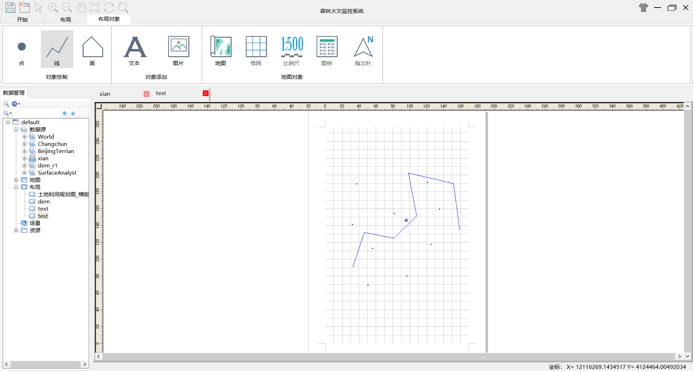

图6-5 创建线

绘制面涉及到MapControl控件下的CreatePolygon、CreateRectangle、CreateRoundRectangle属性，点击系统中的“面”，在面板中，选择合适的位置，创建面要素，如图6-6.

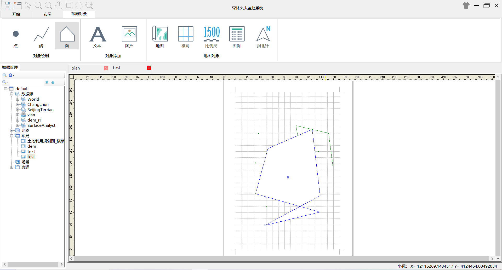

图6-6 绘制面

## 6.2 对象添加

需要注意的是，设置固定大小时，文本的字体高度不能超过255。如果超过255，则系统自动将其固定大小设置为255。创建文本涉及到MapControl控件下的CreateText属性，点击系统中的“文本”，创建文本。如图6-7.

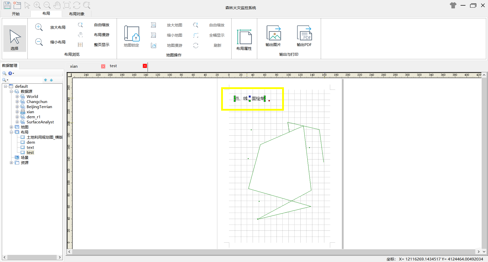

图6-7 添加文本

图片是对地图信息的展示或补充，在地图的制作中不可或缺，点击，在布局中框选出一个矩形，弹出图片路径，选择图片，效果如图6-8.

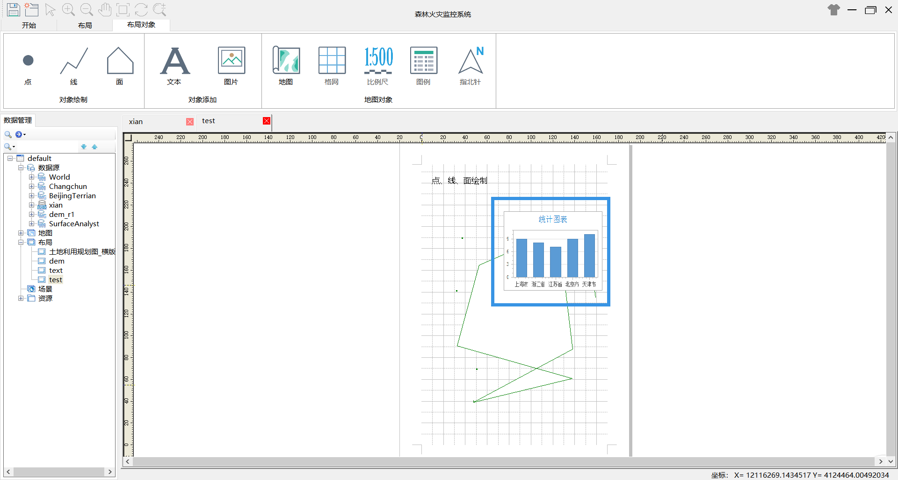

图6-8 添加图片

## 6.3 地图对象

点击“地图”，选择所要进行绘制的地图，如图6-9。绘制数据框。进行显示，如图6-10.

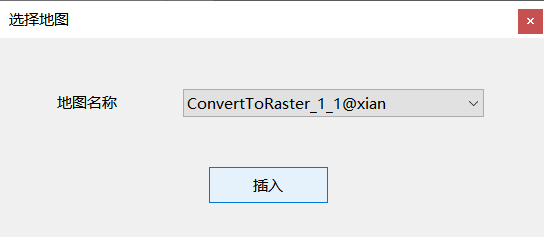

图6-9 选择地图

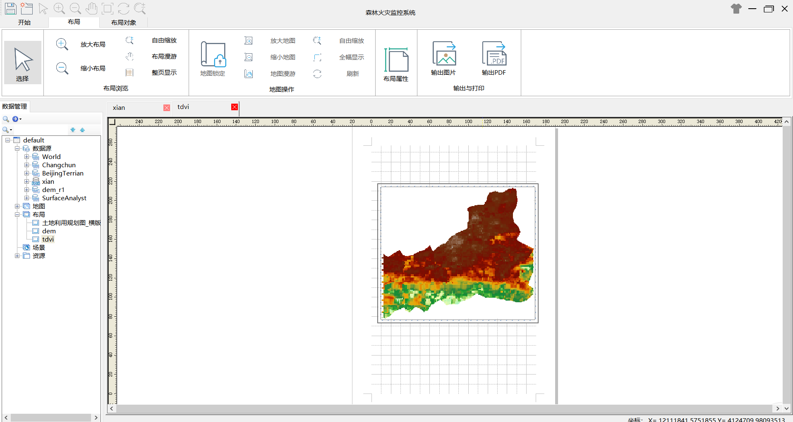

图6-10 插入地图

点击“指北针”，在相应的位置进行绘制，显示如图6-11.

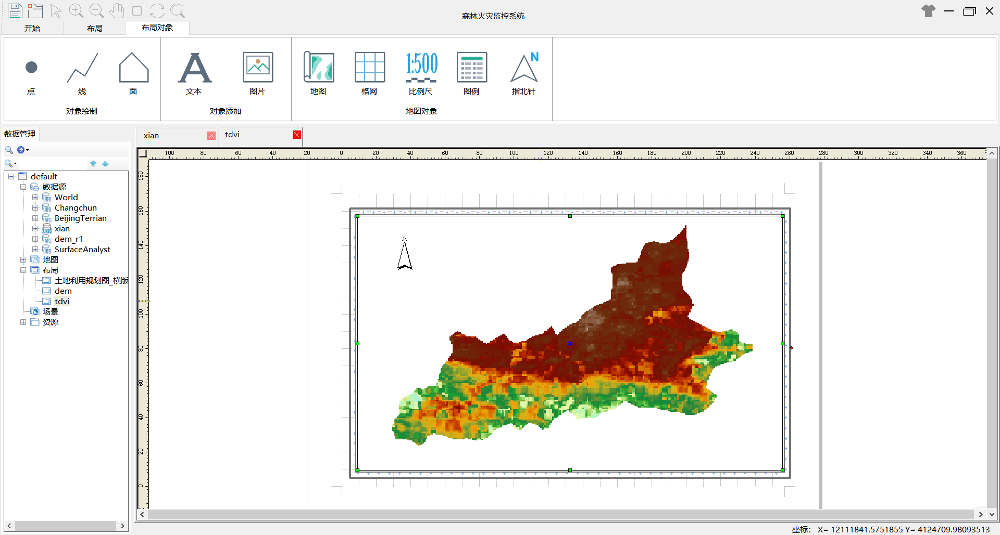

图6-11 添加

比例尺对象同样与地图对象关联显示，随着地图的放大缩小、比例尺的刻度联动变化，因此，在添加比例尺之前，需要先关联地图，关联方法同方向标。在系统中点击“比例尺”，选择合适的样式，如图6-12.

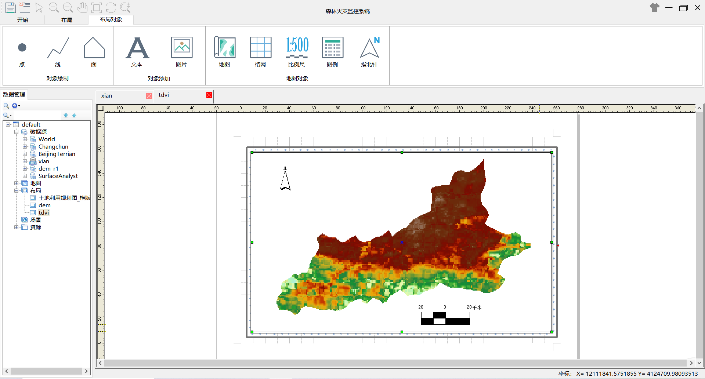

图6-12 比例尺

点击“格网”，弹出格网属性设置，如图6-13，设为想要的样式，点击“确定”，若不合适，可点击“清楚”，清楚当前样式，如图6-14.

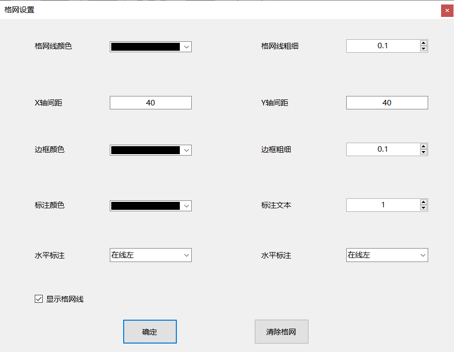

图6-13 格网设置

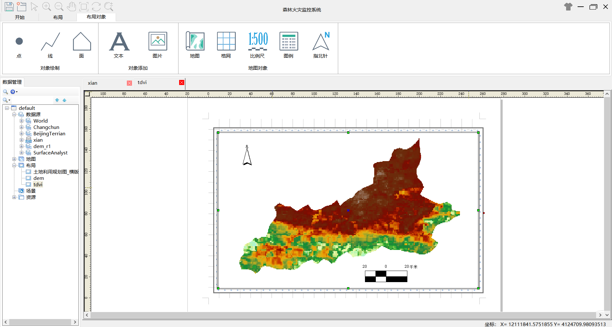

图6-14 添加格网

点击“图例”，在相应的位置进行绘制，如图6-15.

图6-15 图例

## 6.4 布局导出

在地图管理中布局导出，点击“布局导出”，弹出如6-16窗口，选择要导出的布局，点击“浏览”选择输出路径，点击确定，完成布局的导出。

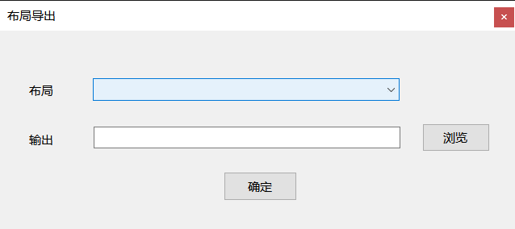

图6-16 导出布局

# 数据管理

## 7.1 数据源

点击，可以选择数据源的引擎类型，点击“浏览”选择路径，选中相应的数据后，如图7-1，若成功打开，右侧会出现数据源信息。也可以新建数据源，如图7-2

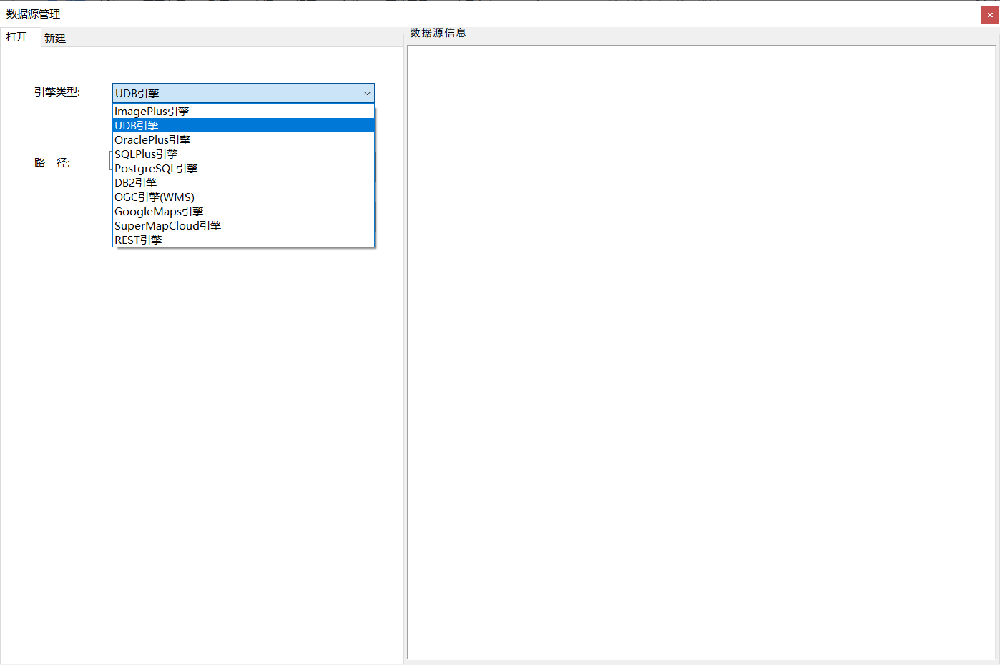

图7-1 选择引擎

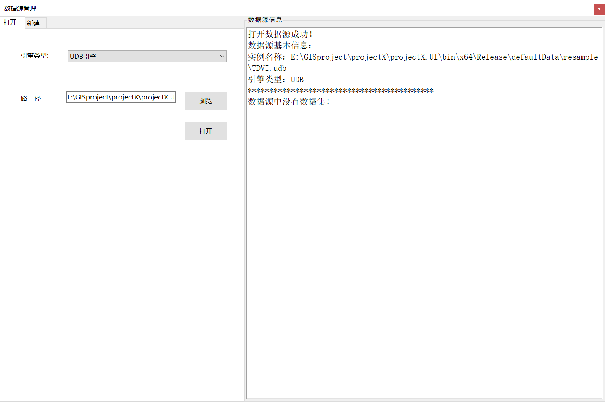

图7-2 数据源信息

## 7.2 数据集

点击，选择自己需要管理编辑的数据源，可以在数据列表中选中相应的数据级，在右侧点击“删除选中”可以删除选中的数据集，在新名称中进行输入修改后的数据集名称，点击“重命名”即可完成数据集的重命名。也可以新建数据集，选择数据集类型，这里支持“点数据集”、“线数据集”、“面数据集”、“文本数据集”、“CAD数据集”、“数据表”、“栅格数据集”、“影像数据集”等类型，输入数据集名称，点击“创建”，即可完成数据集的创-建。如图7-3.

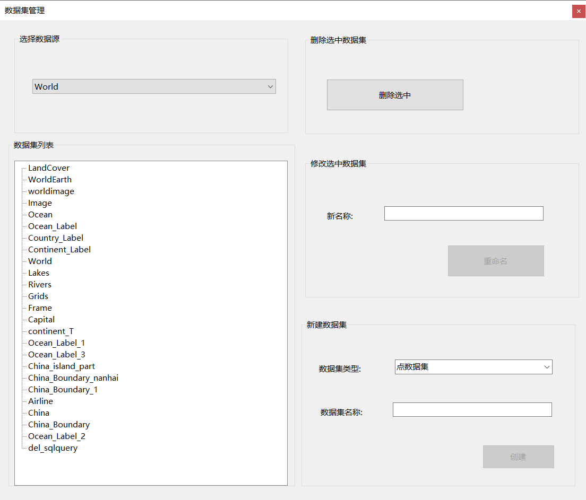

图7-3 数据集管理

## 7.3 图层管理

在左侧的数据管理中，可以进行图层的上移下移，数据的“可显示”“可编辑”“可捕捉”“风格设置”“移除”“重命名”等，以及图层索引顺序、名称顺序等。如图7-4.

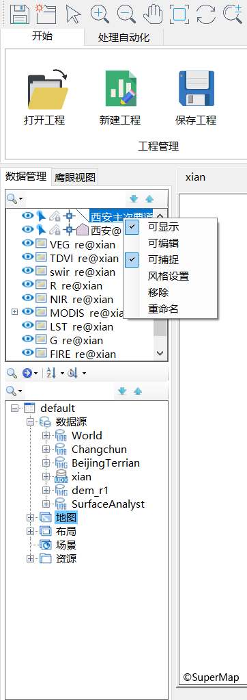

图7-4 图层管理

点击“风格设置”，可以对地图的进行符号设计，可以对“前景颜色”“背景颜色”、透明度”进行设置。如图7-5

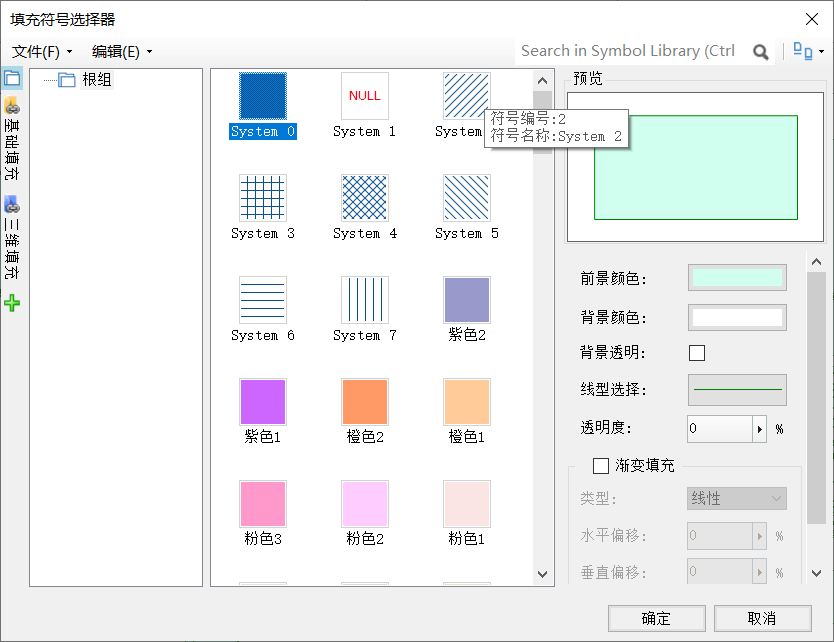

图7-5 符号管理

若有符号库文件，也可进行添加或导入相应符号。完成符号设置后，用户可以进行符号的导出以及属性编辑。如图7-6.

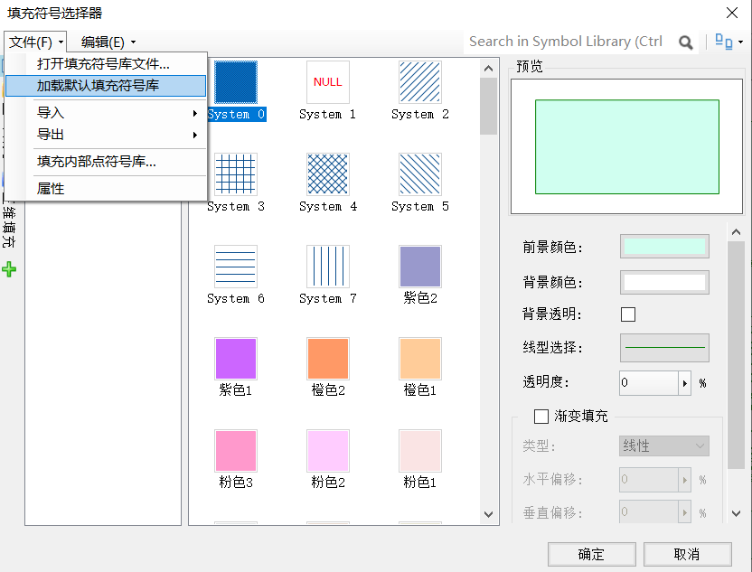

图7-6 导入符号

# 8.选择

“选择”中可以进行属性的查询，关闭其他图层显示只保留所要查询属性的图层显示，右击该图层，勾选“可显示”，点击，弹出所选数据的属性表。若要查询所选要素的属性，右击该图层，勾选“可捕捉”，点击，选中所要查询的要素，点击，查看其属性。如图8-1.

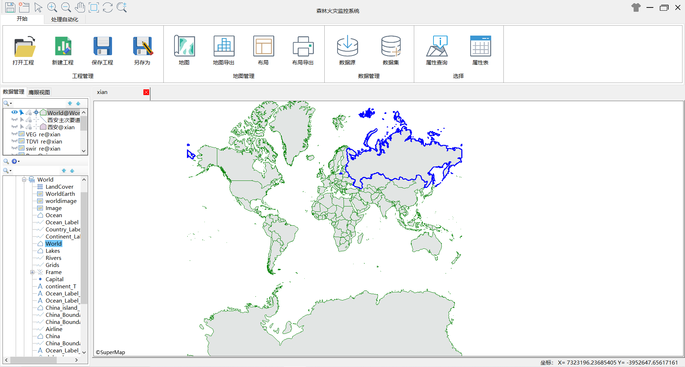

图8-1 选择数据

点击属性表按钮，可以显示当前图层的属性表，如图8-2.

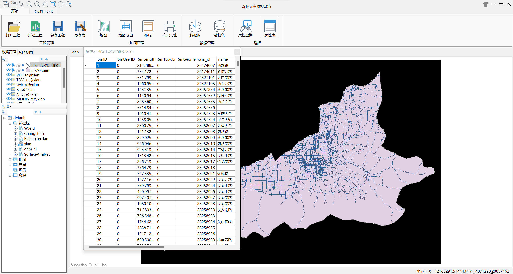

图8-2 属性表

# 9.鹰眼图

点击“鹰眼视图”。左上视图为地图全貌，下方为局部位置的放大图，在左下角可以设置放大倍数为1x，2x，3x。如图9-1.

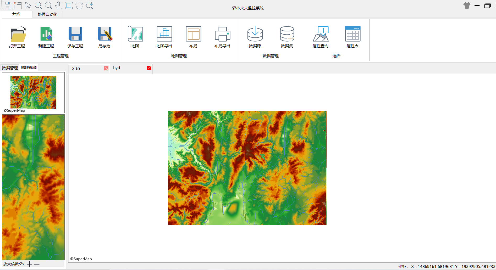

图9-1 鹰眼图显示

# 10.快速提取

系统提供了NDVI与NDWI提取功能以及水文分析。

## 10.1 NDVI提取

归一化植被指数（NDVI）是反映地表植被覆盖信息的一种植被指数，是监测植被类型、生长状态的重要指数。地表植被的覆盖情况、植被覆盖的有无直接对森林火灾的发生与否产生影响，植被的疏密程度对森林火灾发生之后的蔓延也有一定影响。

|  |  | （1） |
| - | - | ----- |

式中:表示近红外波段反射值，表示红外波段反射值。

在“处理自动化”菜单栏下选择“NDVI”，如图10-1，选择“数据源”“影像数据”以及“红波段”“红外波段”对应的波段号，设置输出路径，与输出数据的名称，点击确定，如图10-2.输出NDVI结果，如图10-3.

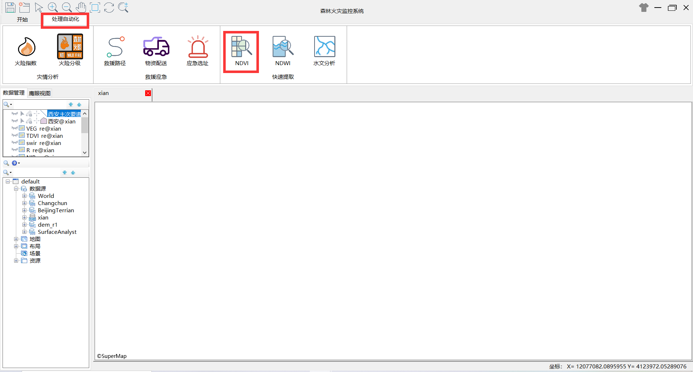

图10-1 NDVI工具


图10-2 参数设置


图10-3 NDVI计算结果

## 10.2 提取NDWI

NDWI（[归一化](https://baike.baidu.com/item/%E5%BD%92%E4%B8%80%E5%8C%96/2215161?fromModule=lemma_inlink)水指数），用遥感影像的特定波段进行归一化差值处理，以凸显影像中的水体信息。点击，选择“数据源”，“影像数据”，如图10-4，“红波段”对应编号，“绿波段”对应编号，设置输出数据源与数据集名称，点击确定，计算NDWI。如图10-5.


图10-4 NDWI参数设置


图10-5 NDWI结果

## 10.3 水文分析

水文分析功能提供了“填洼”“计算流向”“计算流量”“提取水系”“提取流域”，“根据栅格水系和流向栅格提取矢量水系”的功能。点击，选择数据源与DEM数据，点击确定。如图10-6，可以直接输出“洼地”“流向”“流量”“水系”“流域”结果。


图10-6 水文分析


# 11.灾情分析

森林火灾的发生特点，一是由于森林分布面积广，且枝繁叶茂具备一定的隐蔽性，故而导致森林火灾在发生初期并不能很快被察觉，当察觉时，火灾已经燃烧到一定程度且发生蔓延，此时若想快速扑灭难度极大。其次，由于火具有蔓延迅速、突发性强的特点，且受风向的影响，容易发生复燃，单纯依靠人力手持灭火设备对其进行扑灭，难以达到良好效果极易造成事故。火灾发生地的温度要远远高于周边区域，而高光谱遥感技术正是利用这一特点，对森林区域范围内的异常温况进行监测，一旦发现有火灾源头出现，便可以快速对其进行扑灭，避免不必要的牺牲和损失的产生。遥感技术是地面各种景物进行探测和识别的一种综合技术，具有时效性好、节省人力物力、可实现大面积同步观测的特点。

系统利用植被指数与干旱指数相结合得到火险综合预报指数来反映森林火灾发生的难易程度。点击，输入TDVI、NDVI数据，选择当前研究区主要植被类型，设置输出数据名称与数据源，点击“确定”，如图11-1，输出火险指数结果。如图11-2.


图11-1 计算火险指数


图11-2 火线指数结果

根据我国已有的《全国森林火险天气等级》，将森林火险天气等级由低到高划分级、该标准主要考虑的气象因素对火险等级的影响。点击，输入火险指数数据，设置输出数据源与输出数据名称，点击“确定”。


图11-3 火险等级划分


图11-4 火险等级

# 救援应急

## 救援路径

城市中的交通堵塞问题随处可见，交通堵塞是没有规律可循、随机且动态变化的过程。为了实时地反映交通网络的现状，需要让交通堵塞的弧段具有暂时禁行的特性，同时在交通恢复正常后，弧段属性也能实时恢复正常。障碍边、障碍点的概念的提出可以解决上述问题。障碍边、障碍点引进的好处是它们在设置前后与现有的网络环境参数无关，具有相对独立的特性。

救援路径中主要是在根据火灾发生点后进行最佳路径的规划，最佳路径分析，是指在网络上选择N（N大于等于2）个点（称为途经点），求解按照途经点的选择顺序，依次经过这些点的花费最小的路径。“花费最小”有多种理解，如基于单因素考虑的时间最短、费用最低、风景最好、路况最佳、过桥最少、收费站最少、经过乡村最多等。在该实验中，花费最小即用时最短。

方法实现：

TransportationAnalyst类的FindPath方法，用于实现最佳路径分析。按照交通网络分析的步骤，在加载网络模型之后，就可以调用该方法进行最佳路径分析了。

语法：

public TransportationAnalystResult FindPath(TransportationAnalystParameter parameter，Boolean hasLeastEdgeCount)

参数说明：

parameter：指定的交通网络分析参数。

hasLeastEdgeCount：指定是否按照弧段数最少查找。true 表示按照弧段数最少进行查询。

返回值说明：

分析结果对象。

救援路径主要涉及到网络分析，路径分析的相关知识，涉及到结点，弧段，网络，阻力，中心点，障碍点和障碍边等。当灾害来临时，最短时间到达救援地是把危害损失降到最低的有效方法之一。

点击，选择路网数据，如图12-1，选择必经点与当前障碍点，然后点击分析，如图12-2，完成路径的检索。点击“导引”将动画显示行驶路径，如图12-3.


图12-1 选择数据


图12-2 选择必经点与当前障碍点


图12-3 路径

## 物资配送

物流配送是在网络数据集中，给定M个配送中心、N个配送目的地（M,N为大于零的整数）和一些约束条件，分析得到配送顺序和物流路线，从而优化货物运输路径。

其中约束条件可以有：成本费用、车辆数、车辆负载量、收货时间、是否需要回到中心地等，需要根据实际情况将组合的约束条件都考虑进去。就可以结合配送货物量动态生成线路，匹配最优车型，综合考虑发货、收货时间等情况，生成最佳配送线路。

方法实现：

FindVRPPath方法用于实现物流配送分析。

语法：

public VRPAnalystResult findVRPPath(VRPAnalystParameter parameter，VehicleInfo[] vehicleInfos,CenterPointInfo[] centerInfos,DemandPointInfo[] demandInfos）

该接口和之前的物流配送接口findMTSPPath相比，多出了车辆信息、需求量等的设置，可以更充分的满足不同情况下的需求。

参数说明：

parameter：指定的物流配送分析参数对象。

vehicleInfos：车辆信息数组。

centerInfos：中心点信息数组。

demandInfos：需求点信息数组。

返回值说明：

物流配送分析结果对象。

点击，选择路网数据，设置配送中心点与配送目的地，点击“分析”，求解出耗费最短的路径。

图12-4 配送路径

## 应急选址

分析过程中使用的需求点都为网络结点，即除了各种类型的中心点所对应的网络结点，所有网络结点都作为资源需求点参与选址分区分析，如果要排除某部分结点，可以将其设置为障碍点。

是否从中心点分配：从中心点分配，表示资源通过网络传输到需求点；不从中心点分配，表示需求方通过网络前往中心点获得资源。

方法实现：

TransportationAnalyst类的FindLocation方法，用于实现选址分区分析。

语法：

public LocationAnalystResult FindLocation(LocationAnalystParameter parameter)

参数说明：

parameter：指定的选址分区分析参数对象。

返回值说明：

选址分区分析结果对象。

该方法需要传入一个LocationAnalystParameter类型的对象作为参数，通过该对象，可以设置选址分区分析的参数信息，包括资源供给中心集合、期望选址的资源供给中心数量、是否从中心点开始分配，以及权重信息等。

点击，选择路网数据，点击选取中心点，设置中心点的最大阻力及中心点类型，设置期望用于最终设施选址的资源供给中心数量，点击“分析”分析得出结果；


图12-5 选址结果
